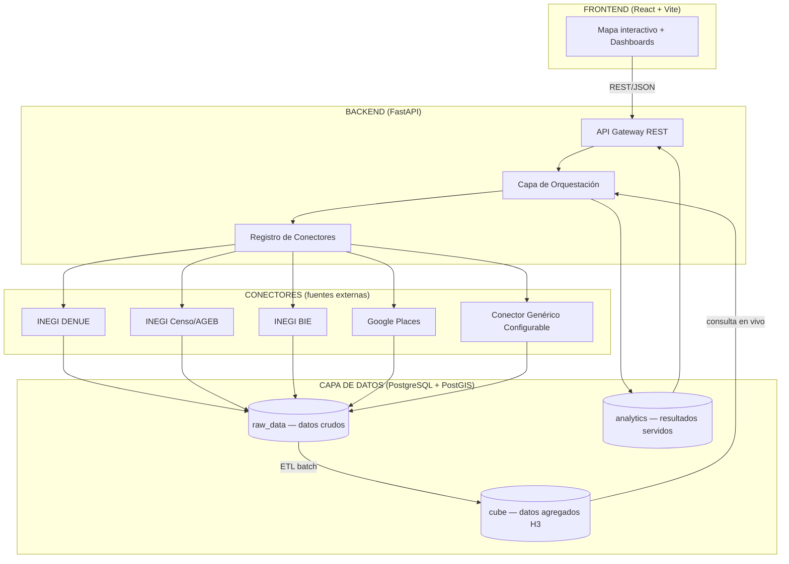
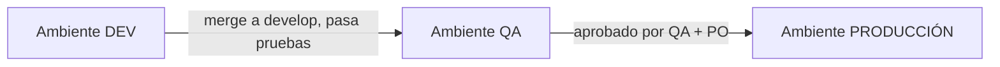

# 01. Arquitectura del Sistema

## 1.1 Visión general

El sistema sigue una arquitectura de **3 capas de datos + API desacoplada del frontend**, diseñada desde el día 1 para escalar de "proyecto local de un usuario" a "SaaS multi-tenant en la nube" sin reescritura.

## 1.2 Componentes principales

### Frontend
- **Stack:** React + Vite + Leaflet/Mapbox GL
- **Responsabilidad:** captura de polígonos/radios dibujados por el usuario, visualización de mapas y dashboards, consumo de la API REST. No contiene lógica de negocio ni acceso directo a datos.

### Backend — API Gateway
- **Stack:** FastAPI (Python)
- **Responsabilidad:** exponer endpoints REST versionados (`/api/v1/...`), validar requests (Pydantic), autenticar/autorizar, delegar a la capa de orquestación.

### Backend — Capa de Orquestación
- **Responsabilidad:** combinar resultados de uno o varios conectores/cubos para responder una pregunta de negocio (ej. "dame la radiografía comercial de esta zona"). Aquí vive la lógica de negocio, no en el Gateway ni en los conectores.

### Backend — Registro de Conectores
- **Responsabilidad:** abstraer cualquier fuente de datos externa (INEGI, Google, proveedores de tráfico/movilidad, futuros) detrás de una interfaz común (`BaseConnector`). Permite agregar fuentes nuevas sin modificar el core del sistema.

### Capa de Datos (PostgreSQL + PostGIS)
Tres esquemas con responsabilidades distintas — ver detalle completo en `04-base-de-datos.md`:

| Esquema | Propósito | Frecuencia de escritura |
|---|---|---|
| `raw_data` | Espejo de lo que devuelven las APIs externas, sin transformar | Batch (sincronización periódica) |
| `cube` | Datos pre-agregados por celda espacial H3, multi-resolución | Batch (ETL nocturno) |
| `analytics` | Resultados de análisis ya calculados, guardados, listos para auditoría/reuso | En vivo (cuando el usuario corre un análisis) |

## 1.3 Principios de diseño

1. **Desacoplamiento fuente-de-datos vs. lógica de negocio.** Ningún módulo de negocio debe saber si un dato viene de DENUE o de un Excel subido a mano — todo pasa por el modelo común `GeoFeature`.
2. **Nunca se consulta `raw_data` en tiempo real desde el frontend.** Las consultas en vivo siempre golpean `cube` o `analytics`, que están optimizados con índices espaciales y datos pre-agregados.
3. **Todo es portable a la nube sin cambio de código**, solo de configuración (variables de entorno). Ningún componente asume que corre en una laptop específica.
4. **Multi-tenancy modelado desde el inicio** (`organization_id` en las tablas relevantes), aunque hoy solo exista una organización activa.

## 1.4 Infraestructura objetivo (Dev local → Cloud)

| Componente | Local (Dev) | Nube (Prod, futuro) |
|---|---|---|
| Backend | Docker / Uvicorn local | Contenedor en ECS/Cloud Run/Render |
| Base de datos | Docker `postgis/postgis` | RDS Postgres / Supabase / Neon (con PostGIS habilitado) |
| Caché | Redis local (Docker) | Redis administrado (ElastiCache/Upstash) |
| Frontend | Vite dev server | Build estático en Vercel/Netlify/S3+CloudFront |
| Jobs batch (ETL del cubo) | Cron local / script manual | Scheduler administrado (Celery Beat + worker, o Cloud Scheduler) |
| Secretos (API keys) | `.env` (no versionado) | Secrets Manager del proveedor cloud |

## 1.5 Diagrama de despliegue por ambiente

Ver detalle completo de ambientes en `07-control-de-versiones-y-ambientes.md`. Resumen:

Cada ambiente tiene su **propia base de datos**, sus **propias credenciales de API**, y nunca comparten datos entre sí.
