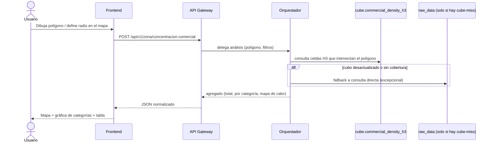
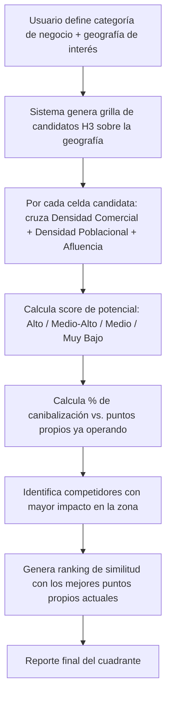
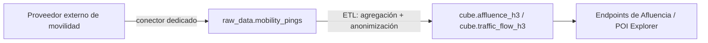
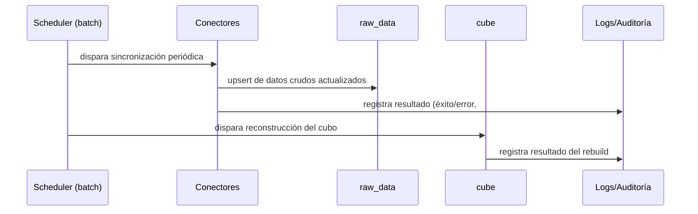

# 02. Flujos de Negocio

Este documento describe el flujo end-to-end de cada módulo funcional, desde la acción del usuario hasta la respuesta final. Sirve como puente entre negocio y desarrollo.

## 2.1 Flujo: Concentración Comercial (MVP actual)

**Pregunta de negocio que responde:** ¿Qué densidad de comercios hay en esta zona? ¿Cuáles son las categorías principales? ¿Cuántos competidores hay?

**Reglas de negocio:**
- El conteo se agrupa por código SCIAN (categoría de giro comercial).
- Se identifica "negocio ancla" cuando una categoría representa una concentración significativamente mayor al promedio de la zona circundante (umbral configurable).
- El resultado se guarda en `analytics.zona_analysis_results` para que el usuario pueda revisitarlo sin recalcular.

## 2.2 Flujo: Densidad Poblacional

**Pregunta de negocio:** ¿Cuál es el mercado residente que estaré alcanzando? ¿Qué características tienen?

1. Usuario selecciona zona (punto + radio, o polígono dibujado).
2. Sistema identifica qué AGEBs intersectan la zona (`raw_data.marco_geoestadistico`).
3. Sistema suma población/hogares/distribución de edad de esos AGEBs desde el cubo `cube.population_density_h3`, ponderando por el % de área de cada AGEB que cae dentro del polígono (no todo-o-nada).
4. Se devuelve: población total, hogares, distribución de edad/género/NSE.

## 2.3 Flujo: Site Selector (fase futura — depende de los módulos anteriores)

**Pregunta de negocio:** ¿Cuál es la mejor ubicación para un nuevo punto de venta?

**Dependencia explícita:** este módulo requiere que existan datos de movilidad/afluencia (ver 2.4), por lo que no es viable en la primera fase del proyecto solo con datos públicos de INEGI.

## 2.4 Flujo: Afluencia de Personas / Vehicular (dependiente de proveedor externo)

A diferencia de los anteriores, este flujo **no se puede resolver con fuentes públicas (INEGI)**. Requiere comprar acceso a un proveedor de datos de movilidad (paneles de geolocalización de dispositivos móviles, ej. Veraset/Unacast/Near, o datos de tráfico tipo TomTom/Google Roads).

**Nota de negocio:** este módulo queda fuera del alcance del MVP. Se documenta aquí para que el diseño de base de datos y conectores ya contemple su llegada futura (ver `04-base-de-datos.md`, tabla `cube.traffic_flow_h3` ya provisionada).

## 2.5 Flujo transversal: sincronización de datos (todos los módulos)

Este flujo corre **independiente de cualquier usuario conectado** — es lo que mantiene el sistema rápido y actualizado sin que el usuario final pague el costo de la consulta en vivo.
