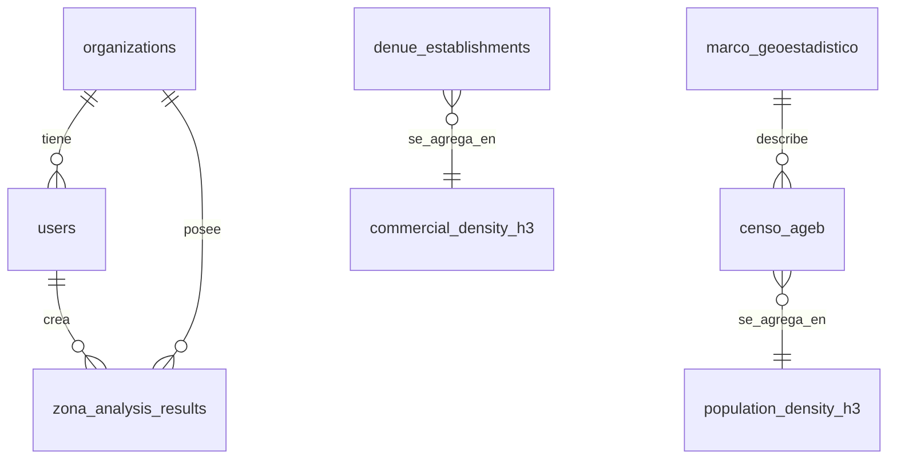

# 04. Base de Datos

## 4.1 Motor y extensiones

- **Motor:** PostgreSQL 16
- **Extensiones requeridas:** `postgis`, `h3`, `h3_postgis`, `pgcrypto` (para `gen_random_uuid()`)
- **Razón de elección:** ver ADR-001 en `06-decisiones-tecnicas-adr.md`

## 4.2 Esquemas y su propósito

| Esquema | Propósito | Quién escribe | Quién lee |
|---|---|---|---|
| `core` | Control, organizaciones, usuarios, credenciales | Backend (admin) | Backend (auth) |
| `raw_data` | Espejo crudo de cada fuente externa | Conectores (batch) | Solo el ETL del cubo (excepcional: fallback) |
| `cube` | Datos pre-agregados por celda H3, multi-resolución | ETL (batch nocturno) | API en tiempo real |
| `analytics` | Resultados de análisis ya calculados y guardados | API (al momento de análisis) | API + usuario (historial) |



## 4.3 Esquema `core`

```sql
CREATE TABLE core.organizations (
    id              UUID PRIMARY KEY DEFAULT gen_random_uuid(),
    name            VARCHAR(255) NOT NULL,
    plan            VARCHAR(50) DEFAULT 'starter',
    created_at      TIMESTAMPTZ DEFAULT now(),
    is_active       BOOLEAN DEFAULT true
);

CREATE TABLE core.users (
    id              UUID PRIMARY KEY DEFAULT gen_random_uuid(),
    organization_id UUID REFERENCES core.organizations(id),
    email           VARCHAR(255) UNIQUE NOT NULL,
    hashed_password VARCHAR(255) NOT NULL,
    role            VARCHAR(50) DEFAULT 'analyst',
    created_at      TIMESTAMPTZ DEFAULT now()
);

CREATE TABLE core.api_credentials (
    id              UUID PRIMARY KEY DEFAULT gen_random_uuid(),
    organization_id UUID REFERENCES core.organizations(id),
    connector_name  VARCHAR(100) NOT NULL,
    encrypted_value TEXT NOT NULL,         -- nunca texto plano, cifrado a nivel app
    created_at      TIMESTAMPTZ DEFAULT now()
);

CREATE TABLE core.query_log (
    id              BIGSERIAL PRIMARY KEY,
    organization_id UUID REFERENCES core.organizations(id),
    user_id         UUID REFERENCES core.users(id),
    endpoint        VARCHAR(255),
    request_summary JSONB,
    duration_ms     INTEGER,
    status_code     INTEGER,
    created_at      TIMESTAMPTZ DEFAULT now()
);
```

## 4.4 Esquema `raw_data`

```sql
CREATE EXTENSION IF NOT EXISTS postgis;

CREATE TABLE raw_data.denue_establishments (
    id                    BIGSERIAL PRIMARY KEY,
    clee                  VARCHAR(50) UNIQUE,
    nombre                VARCHAR(255),
    razon_social          VARCHAR(255),
    clase_actividad       VARCHAR(255),
    codigo_scian          VARCHAR(10),
    estrato_personal      VARCHAR(50),
    entidad               VARCHAR(100),
    municipio             VARCHAR(100),
    localidad             VARCHAR(100),
    colonia               VARCHAR(150),
    cp                    VARCHAR(10),
    geom                  GEOMETRY(Point, 4326),
    fuente_actualizacion  DATE,
    fetched_at            TIMESTAMPTZ DEFAULT now(),
    raw_response          JSONB
);
CREATE INDEX idx_denue_geom  ON raw_data.denue_establishments USING GIST (geom);
CREATE INDEX idx_denue_scian ON raw_data.denue_establishments (codigo_scian);

CREATE TABLE raw_data.marco_geoestadistico (
    id          BIGSERIAL PRIMARY KEY,
    nivel       VARCHAR(20),   -- 'ageb' | 'municipio' | 'localidad'
    cve_geo     VARCHAR(20) UNIQUE,
    entidad     VARCHAR(100),
    municipio   VARCHAR(100),
    geom        GEOMETRY(MultiPolygon, 4326),
    fetched_at  TIMESTAMPTZ DEFAULT now()
);
CREATE INDEX idx_marco_geom ON raw_data.marco_geoestadistico USING GIST (geom);

CREATE TABLE raw_data.censo_ageb (
    id              BIGSERIAL PRIMARY KEY,
    cve_ageb        VARCHAR(20) REFERENCES raw_data.marco_geoestadistico(cve_geo),
    poblacion_total INTEGER,
    total_hogares   INTEGER,
    pob_masculina   INTEGER,
    pob_femenina    INTEGER,
    edad_0_14       INTEGER,
    edad_15_24      INTEGER,
    edad_25_49      INTEGER,
    edad_50_60      INTEGER,
    edad_60_mas     INTEGER,
    anio_censo      INTEGER DEFAULT 2020,
    fetched_at      TIMESTAMPTZ DEFAULT now()
);

CREATE TABLE raw_data.external_api_cache (
    id              BIGSERIAL PRIMARY KEY,
    connector_name  VARCHAR(100),
    request_hash    VARCHAR(64),
    geom            GEOMETRY(Geometry, 4326),
    response_data   JSONB,
    fetched_at      TIMESTAMPTZ DEFAULT now(),
    expires_at      TIMESTAMPTZ
);
CREATE INDEX idx_extcache_geom ON raw_data.external_api_cache USING GIST (geom);
CREATE INDEX idx_extcache_hash ON raw_data.external_api_cache (request_hash);
```

## 4.5 Esquema `cube`

```sql
CREATE EXTENSION IF NOT EXISTS h3;
CREATE EXTENSION IF NOT EXISTS h3_postgis;

CREATE TABLE cube.commercial_density_h3 (
    h3_index                VARCHAR(20) PRIMARY KEY,
    h3_resolution           SMALLINT,
    entidad                 VARCHAR(100),
    municipio               VARCHAR(100),
    total_establecimientos  INTEGER,
    por_categoria           JSONB,
    top_categoria           VARCHAR(255),
    geom_centroid           GEOMETRY(Point, 4326),
    geom_hexagon            GEOMETRY(Polygon, 4326),
    last_refreshed          TIMESTAMPTZ DEFAULT now()
);
CREATE INDEX idx_cube_comercial_geom ON cube.commercial_density_h3 USING GIST (geom_hexagon);

CREATE TABLE cube.population_density_h3 (
    h3_index          VARCHAR(20) PRIMARY KEY,
    h3_resolution     SMALLINT,
    poblacion_total   INTEGER,
    total_hogares     INTEGER,
    distribucion_edad JSONB,
    nse_distribucion  JSONB,
    geom_hexagon      GEOMETRY(Polygon, 4326),
    last_refreshed    TIMESTAMPTZ DEFAULT now()
);

CREATE TABLE cube.traffic_flow_h3 (    -- provisionada para fase futura
    h3_index                VARCHAR(20) PRIMARY KEY,
    flujo_promedio_diario   INTEGER,
    velocidad_promedio      NUMERIC(5,2),
    distribucion_horaria    JSONB,
    geom_hexagon            GEOMETRY(Polygon, 4326),
    last_refreshed          TIMESTAMPTZ DEFAULT now()
);

CREATE TABLE cube.affluence_h3 (       -- provisionada para fase futura (movilidad de personas)
    h3_index             VARCHAR(20) PRIMARY KEY,
    visitas_promedio_dia  INTEGER,
    distribucion_horaria   JSONB,
    distribucion_nse        JSONB,
    geom_hexagon             GEOMETRY(Polygon, 4326),
    last_refreshed            TIMESTAMPTZ DEFAULT now()
);
```

## 4.6 Esquema `analytics`

```sql
CREATE TABLE analytics.zona_analysis_results (
    id               UUID PRIMARY KEY DEFAULT gen_random_uuid(),
    organization_id  UUID REFERENCES core.organizations(id),
    user_id          UUID REFERENCES core.users(id),
    polygon          GEOMETRY(Polygon, 4326),
    analysis_type    VARCHAR(50),
    result_json      JSONB,
    created_at       TIMESTAMPTZ DEFAULT now()
);
CREATE INDEX idx_zona_results_polygon ON analytics.zona_analysis_results USING GIST (polygon);

CREATE TABLE analytics.saved_polygons (
    id               UUID PRIMARY KEY DEFAULT gen_random_uuid(),
    organization_id  UUID REFERENCES core.organizations(id),
    user_id          UUID REFERENCES core.users(id),
    nombre           VARCHAR(255),
    polygon          GEOMETRY(Polygon, 4326),
    created_at       TIMESTAMPTZ DEFAULT now()
);
```

## 4.7 Migraciones

Todo cambio de esquema se realiza vía **Alembic**, nunca editando la base de datos a mano en ningún ambiente. Cada migración:
- Vive versionada en `backend/alembic/versions/`
- Se aplica automáticamente en el pipeline de CI/CD al desplegar a QA/Producción
- Tiene su `downgrade()` implementado (reversible)

## 4.8 Relación con el Data Lake / Data Mart

Este modelo (`raw_data` → `cube` → `analytics`) es la versión "ligera" de un patrón de Data Lake/Data Mart, corriendo dentro del mismo Postgres mientras el volumen lo permite. El detalle de cuándo y cómo separar esto en herramientas dedicadas (S3 + Athena, BigQuery, ClickHouse) está en `09-data-lake-y-data-mart.md`.
