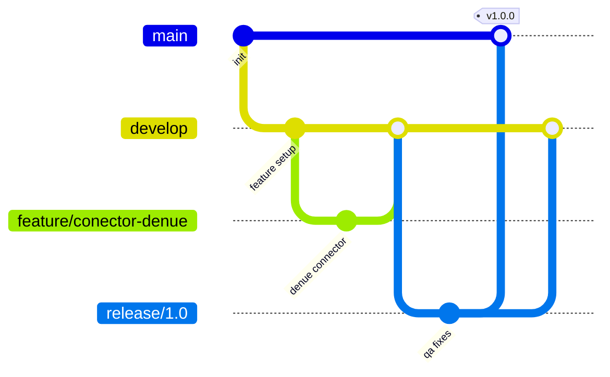
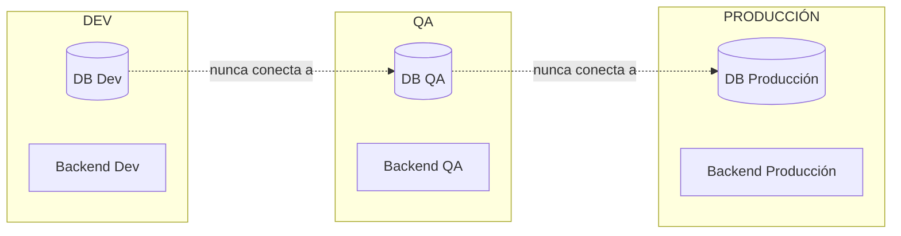
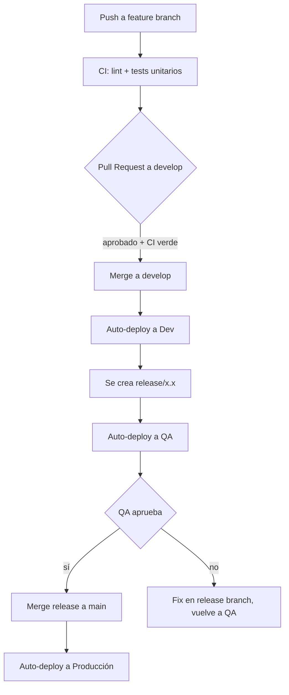

# 07. Control de Versiones y Ambientes

## 7.1 Regla no negociable

> **Todo el código vive en Git, en un repositorio remoto (GitHub o GitLab). Nunca en una computadora personal sin respaldo, nunca como archivo `.zip` con nombres tipo `final_v2_ahora_si.zip`, `proyecto_definitivo_2.rar`, etc.**

Si un archivo no está en el repositorio remoto, **no existe** para efectos del proyecto.

## 7.2 Estructura de repositorios

Se recomienda **monorepo** para esta fase del proyecto (equipo pequeño, mismo ciclo de vida de frontend/backend/docs):

```
geodata-clone/
├── backend/              # FastAPI + conectores + DB
├── frontend/              # React + Vite
├── docs/                  # esta documentación
├── infra/                 # docker-compose, IaC (Terraform a futuro)
├── .github/workflows/     # CI/CD (o .gitlab-ci.yml si es GitLab)
├── .gitignore
└── README.md
```

Si el equipo crece o los ciclos de despliegue se desacoplan (ej. el frontend lo lleva otro equipo), se puede migrar a **multi-repo** más adelante — no es una decisión irreversible.

## 7.3 Estrategia de ramas (Git Flow simplificado)



| Rama | Propósito | Despliega automáticamente a |
|---|---|---|
| `main` | Código en producción, siempre estable | **Producción** |
| `develop` | Integración continua de features | **Dev** |
| `release/x.x` | Estabilización antes de salir a producción | **QA** |
| `feature/nombre-feature` | Trabajo individual sobre una funcionalidad | (ninguno, solo PRs) |
| `hotfix/nombre-bug` | Corrección urgente sobre producción | Producción (tras aprobación) |

## 7.4 Reglas del flujo

1. **Nadie hace commit directo a `main` ni a `develop`.** Todo cambio entra vía Pull Request / Merge Request.
2. Todo PR requiere **al menos una revisión** antes de hacer merge (aunque el equipo sea de 1-2 personas, esto fuerza una segunda lectura — puede ser autorrevisión al día siguiente si no hay más gente).
3. Los PRs hacia `release/*` y `main` requieren que el pipeline de CI (tests + build) pase en verde.
4. Los commits siguen [Conventional Commits](https://www.conventionalcommits.org/): `feat:`, `fix:`, `docs:`, `chore:`, `refactor:` — esto permite generar changelogs automáticos.
5. Cada release se etiqueta (`git tag v1.0.0`) y queda asociada a un Release en GitHub/GitLab con notas de cambios.

## 7.5 Ambientes — definición y aislamiento

| Ambiente | Propósito | Quién accede | Datos |
|---|---|---|---|
| **Desarrollo (Dev)** | Donde se programa y se prueban features en construcción | Equipo de desarrollo | Datos sintéticos / subconjunto pequeño real, nunca datos sensibles de clientes reales |
| **QA / Testing** | Donde se valida que una release funciona antes de salir a usuarios reales | Equipo de desarrollo + QA + Product Owner | Copia anonimizada/reducida de datos, o datos de prueba representativos |
| **Producción** | Donde viven los usuarios reales | Usuarios finales + acceso restringido del equipo (solo lo necesario) | Datos reales |

**Regla no negociable:** estos ambientes **nunca comparten base de datos, nunca comparten credenciales de API, y nunca se mezclan**. Cada uno tiene su propio `.env` / Secrets Manager.



## 7.6 Pipeline de CI/CD (resumen)



## 7.7 Variables de entorno y secretos

- Ningún secreto (API keys de INEGI/Google, contraseñas de DB, JWT secret) se guarda en el repositorio, ni siquiera en `.env.example` con valores reales.
- `.env.example` documenta **qué variables existen**, nunca sus valores reales.
- En Dev: `.env` local (ignorado por `.gitignore`).
- En QA/Producción: variables inyectadas vía el Secrets Manager del proveedor cloud (o variables de entorno protegidas del CI/CD como GitHub Actions Secrets / GitLab CI/CD Variables).

## 7.8 Checklist mínimo antes de habilitar este flujo

- [ ] Repositorio creado en GitHub o GitLab (privado)
- [ ] Ramas `main` y `develop` protegidas (no permiten push directo)
- [ ] Pipeline de CI configurado (lint + tests)
- [ ] 3 bases de datos separadas provisionadas (Dev, QA, Prod)
- [ ] Secrets Manager configurado para QA y Producción
- [ ] `.gitignore` cubre `.env`, `__pycache__/`, `node_modules/`, archivos de credenciales
