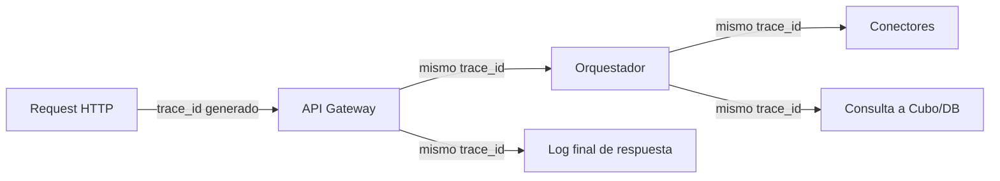

# 08. Logging y Observabilidad

## 8.1 Principio rector

> Tener datos no sirve de nada si, cuando algo falla, nadie puede reconstruir **qué pasó, cuándo, a quién y por qué**. El logging no es un detalle técnico opcional — es lo que permite operar el sistema con confianza.

## 8.2 Qué se registra (obligatorio desde el MVP)

| Categoría | Qué se registra | Dónde vive |
|---|---|---|
| **Login / Autenticación** | Intentos de login (éxito y fallo), origen (IP), generación/renovación de tokens, logout | `core.query_log` + log estructurado |
| **Errores** | Excepciones no controladas, fallos de conectores externos, timeouts, errores de validación | Log estructurado + sistema de alertas |
| **Consultas importantes** | Cada análisis de zona ejecutado (qué endpoint, qué organización/usuario, qué polígono, tiempo de respuesta) | `core.query_log` + `analytics.zona_analysis_results` |
| **Acciones de usuario** | Crear/eliminar análisis guardado, cambios de configuración, alta de credenciales de API | Log estructurado (auditoría) |
| **Procesos automáticos** | Cada corrida de sincronización de conectores y de reconstrucción del cubo: inicio, fin, # registros procesados, errores | Log estructurado dedicado a jobs batch |

## 8.3 Formato del log: estructurado, no texto libre

Todo log se emite en **JSON estructurado**, nunca como texto libre tipo `print()`. Esto permite buscar/filtrar/alertar sobre logs en cualquier herramienta (CloudWatch, Datadog, Grafana Loki, etc.) sin parsers frágiles.

```json
{
  "timestamp": "2026-06-20T14:32:01Z",
  "level": "ERROR",
  "service": "backend-api",
  "environment": "produccion",
  "organization_id": "uuid-org",
  "user_id": "uuid-user",
  "event": "conector_sync_failed",
  "connector_name": "inegi_denue",
  "message": "Timeout al conectar con API de INEGI",
  "trace_id": "abc123",
  "details": { "http_status": 504, "retry_count": 3 }
}
```

**Campos obligatorios en todo log:** `timestamp`, `level`, `service`, `environment`, `event`, `trace_id`.

## 8.4 Niveles de log y su uso

| Nivel | Cuándo usarlo |
|---|---|
| `DEBUG` | Detalle técnico solo relevante en Dev, nunca activo por defecto en Producción |
| `INFO` | Eventos normales de negocio: login exitoso, análisis ejecutado, sincronización completada |
| `WARNING` | Algo inesperado pero no crítico: un conector tardó más de lo normal, un fallback se activó |
| `ERROR` | Algo falló y requiere atención: excepción no controlada, conector caído |
| `CRITICAL` | El sistema no puede operar: base de datos inaccesible, fallo masivo |

## 8.5 Trazabilidad (`trace_id`)

Cada request HTTP entrante genera un `trace_id` único (o lo propaga si ya viene de un proxy/gateway). Este `trace_id` viaja a través de:



Esto permite reconstruir el camino completo de una sola consulta que falló, sin tener que adivinar qué componente la generó.

## 8.6 Dónde viven los logs por ambiente

| Ambiente | Destino de logs (recomendado) |
|---|---|
| Dev (local) | Consola / archivo local, retención corta |
| QA | Agregador centralizado (ej. Grafana Loki, CloudWatch Logs) con retención de ~30 días |
| Producción | Agregador centralizado con retención de al menos 90 días + alertas activas sobre `ERROR`/`CRITICAL` |

**Importante:** los logs de Producción contienen datos potencialmente sensibles (IDs de organización, IPs) — el acceso a la herramienta de logs debe estar restringido al mismo nivel que el acceso a producción misma.

## 8.7 Alertas mínimas a configurar

- Tasa de errores (`ERROR`/`CRITICAL`) por encima de un umbral en una ventana de tiempo → notificación inmediata (Slack/email).
- Un conector falla 3 veces consecutivas en su sincronización programada → alerta.
- El job de reconstrucción del cubo no corre en su ventana esperada → alerta (esto significa que las consultas en vivo empezarán a servir datos viejos sin que nadie lo note si no se alerta).
- Tiempo de respuesta promedio de los endpoints de análisis por encima de un umbral → alerta de performance.

## 8.8 Relación con auditoría y futuro billing

`core.query_log` (ver `04-base-de-datos.md`) no es solo para debugging — es la base para, en el modelo SaaS futuro, poder responder preguntas como "¿cuántas consultas hizo la organización X este mes?" para fines de facturación por uso, y para poder auditar accesos en caso de una disputa o incidente de seguridad.
