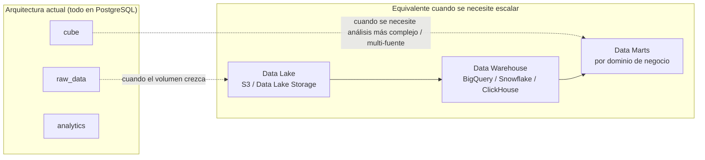
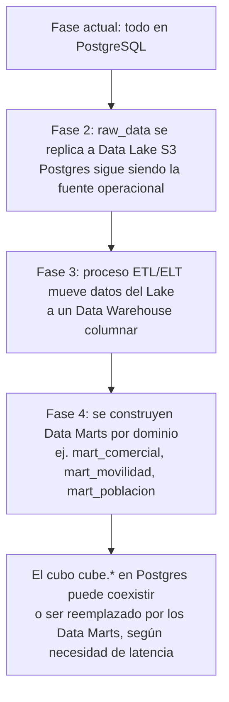

# 09. Data Lake y Data Mart

## 9.1 Por qué este tema importa para este proyecto específicamente

El sistema integra múltiples fuentes externas heterogéneas (varias APIs de INEGI, Google Places, y en el futuro proveedores de movilidad/tráfico). A medida que el catálogo de conectores y el volumen de datos crece, conviene tener claro **cuándo el modelo actual (todo en Postgres) deja de ser suficiente** y qué viene después — sin necesidad de implementarlo todavía.

## 9.2 Vocabulario (para que todo el equipo hable el mismo idioma)

| Término | Definición en este proyecto |
|---|---|
| **Data Lake** | Repositorio de datos crudos, en su formato original o casi original, de bajo costo de almacenamiento, sin estructura rígida obligatoria. En este proyecto: equivalente conceptual al esquema `raw_data`, pero pensado para escalar fuera de Postgres cuando el volumen lo justifique. |
| **Data Warehouse** | Repositorio de datos estructurados, modelados y optimizados para análisis (esquemas en estrella/copo de nieve). |
| **Data Mart** | Subconjunto del Data Warehouse, enfocado en un área de negocio específica (ej. "todo lo de concentración comercial" o "todo lo de movilidad vehicular"). En este proyecto: equivalente conceptual al esquema `cube`. |

## 9.3 Mapeo: lo que ya construimos vs. terminología estándar de la industria

**Lectura clave:** no estamos "construyendo mal" al usar solo Postgres ahora — estamos construyendo la **versión correcta para la escala actual**, con los límites de cada capa ya bien definidos para que la migración futura sea de "mover datos a otra tecnología" y no de "rediseñar todo el sistema".

## 9.4 Señales que indicarán que es momento de migrar a un Data Lake real

No se migra "porque sí" o por moda — se migra cuando aparecen señales concretas:

| Señal | Qué indica |
|---|---|
| `raw_data` supera varias decenas de millones de filas y las cargas batch empiezan a tardar horas | Postgres como almacén crudo se vuelve costoso de operar |
| Se necesita almacenar datos no tabulares (imágenes satelitales, archivos de proveedores de movilidad en formato propietario) | Postgres no es el lugar natural para esto; un object storage (S3) sí |
| Se necesita que Data Science/ML entrene modelos (ej. el futuro "Site Selector") sobre todo el histórico crudo, no solo el cubo agregado | Los Data Warehouses columnar (BigQuery, ClickHouse, Snowflake) son órdenes de magnitud más rápidos para este tipo de carga analítica masiva que Postgres |
| Se necesita combinar datos de muchas organizaciones para analítica agregada (ej. benchmarks de industria) sin afectar el rendimiento operativo del sistema transaccional | Separar el sistema operacional (Postgres, sirve la app) del sistema analítico (Data Warehouse, sirve reportes pesados) evita que un análisis pesado tumbe el rendimiento de la aplicación en vivo |

## 9.5 Ruta de migración propuesta (cuando aplique, no ahora)

**Importante:** el `cube` que ya diseñamos (capa de agregados H3 en Postgres) **no desaparece necesariamente** al migrar — sigue siendo útil como capa de "caché caliente" de baja latencia para la aplicación en vivo, mientras los Data Marts en el Warehouse sirven análisis más pesados (ej. reportes ejecutivos, entrenamiento de modelos de IA, comparativas multi-organización).

## 9.6 Decisión para esta fase del proyecto

**No se implementa Data Lake/Data Mart como herramientas separadas todavía.** Se documenta esta estrategia para que:
1. El esquema actual (`raw_data`/`cube`/`analytics`) se diseñe ya pensando en esta evolución (nombres de esquema, separación de responsabilidades).
2. El equipo no se sorprenda ni tenga que rediseñar desde cero cuando llegue el momento de escalar.
3. Cualquier decisión futura de "migrar a BigQuery/Snowflake/ClickHouse" se tome basada en señales concretas (sección 9.4), no por anticipación prematura que añadiría complejidad innecesaria hoy.

Esta decisión queda registrada también como ADR — ver `06-decisiones-tecnicas-adr.md`.
